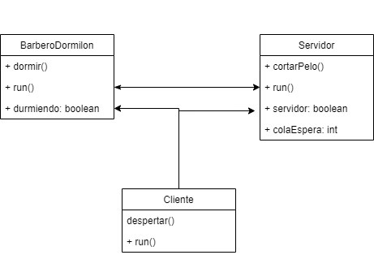

# Barbero Dormilón

El siguiente problema fue formulado por Edsger Dijkstra, científico en ciencias de la computación e ingeniero en sistemas informáticos, quien contribuyó en diversas áreas tales como : desarrollo de algoritmos, paradigmas de programación, sistemas operativos y construcciones de compiladores. Es famoso por el algoritmo descrito por él y que lleva su nombre, el cual sirve para encontrar el camino más corto en un grafo dado un vértice de origen. 

El enunciado del problema es el siguiente:

Existe una barbería en donde el barbero que la atiende corta el cabello a los clientes que llegan y cuando no hay ninguno, se pone a dormir. El barbero tiene una silla para cortar el cabello a donde atiende a un cliente y una sala de espera con 20 sillas en donde pueden sentarse los clientes que llegan mientras esperan. Cuando el barbero termina de cortar el cabello a un cliente, regresa a la sala de espera a ver si hay personas esperando, si las hay trae consigo a una persona para cortarle el cabello. Si no hay clientes esperando, se pone a dormir en la silla para cortar cabello.
Cada cliente que llega a la barbería observa lo que el barbero está haciendo. Si el barbero se encuentra durmiendo, el cliente lo despierta y se sienta en la silla para cortar el cabello. Si el barbero está cortando el pelo a alguien, entonces el cliente se coloca en una silla de la sala de espera. Si no hay sillas disponibles, entonces el cliente se va del lugar. Se deberá desarrollar el software que modele el problema e implementar los algoritmos necesarios para solucionar los posibles problemas que puedan existir al ejecutarse múltiples procesos.

## Diagrama de Clases:



Se observan 3 clases en el problema, 

- El barbero dormilón
- El servidor, el cual en este caso es la silla del barbero
- El cliente

Se cuentan con los siguientes métodos para la interacción:

- despertar(): El cliente despierta al barbero
- cortarPelo() : servicio en el que el barbero corta el pelo al cliente en la silla del barbero.
- dormir(): el barbero duerme.

Se cuentan con las siguientes variables que definen estados y cantidades:

- colaEspera: cantidad de clientes en espera.
- durmiendo: indica si el barbero está durmiendo
- servidor: indica si la silla se encuentra ocupada.

## Manejo de Hilos:

En el problema se cuentan con:

- 1 Hilo correspondiente al barbero.
- 1 Hilo correspondiente a la silla del barbero.
- n Hilos correspondientes a los clientes.

## Manejo de Bloqueos:

### Bloqueos de escritura:

- Cuando llega un nuevo cliente a la barbería, se registra su entrada a la cola de espera.
- Cuando un cliente se corta el pelo, únicamente puede ingresar uno al proceso.

Proceso de bloqueo de escritura:

```java
try {
  // Bloqueo de escritura
  this.candadoLecturaEscritura.writeLock().lock();
	// Acción de escritura
} catch (Exception e) {
  System.out.println(e);
} finally{
  // Desbloqueo de escritura
  this.candadoLecturaEscritura.writeLock().unlock();
}
```

### Bloqueos de Lectura:

- Cuando un cliente quiere validar si el barbero está durmiendo, para entonces despertarlo o no.
- Cuando el cliente valida si la silla se encuentra ocupada o no, para evitar que dos clientes perciban una silla activa y se produzca un bloqueo al tener dos clientes intentando sentarse en la silla.
- El barbero valida si no hay clientes en espera para así dormir.

```java
try {
  // Bloqueo de lectura
  this.candadoLecturaEscritura.readLock().lock();
	// Acción de lectura
} catch (Exception e) {
  System.out.println(e);
} finally{
  // Desbloqueo de lectura
  this.candadoLecturaEscritura.readLock().unlock();
}
```